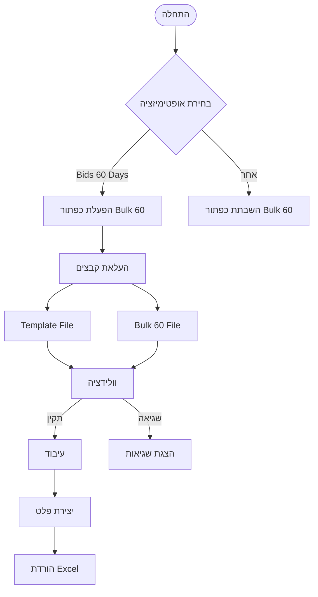
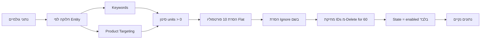
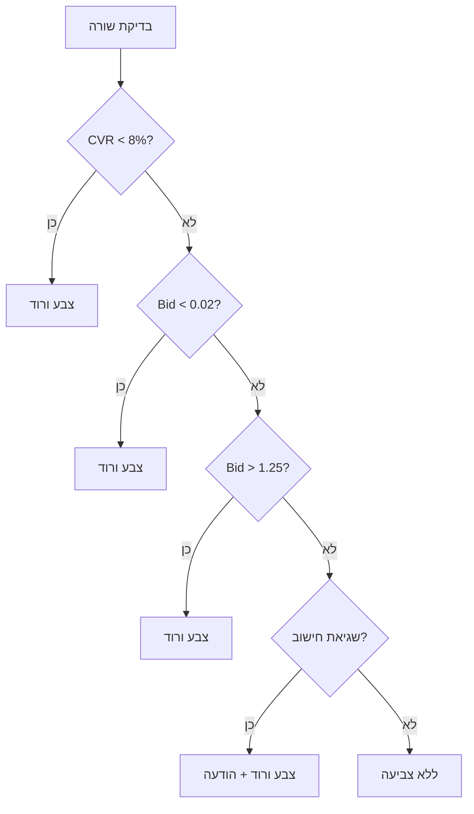
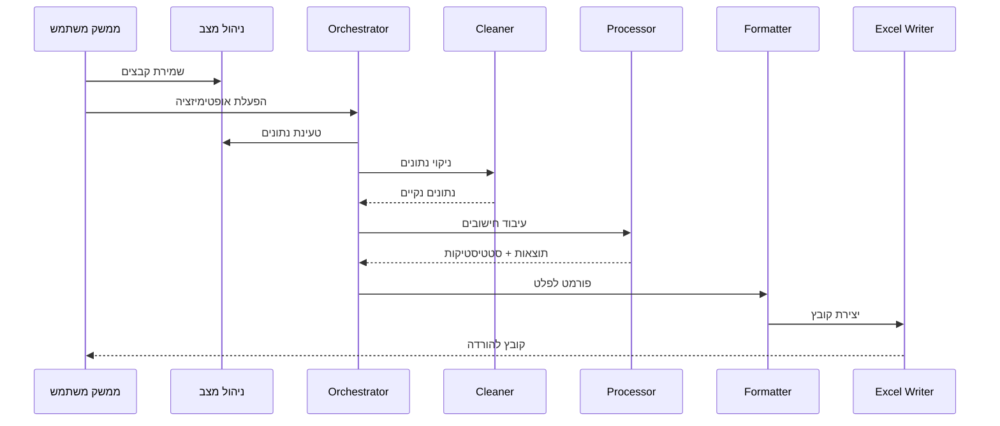
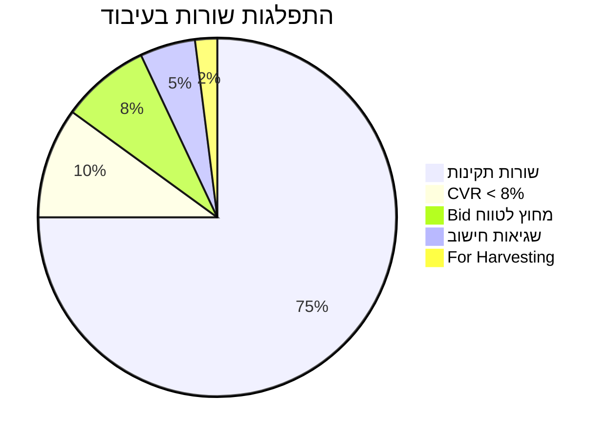
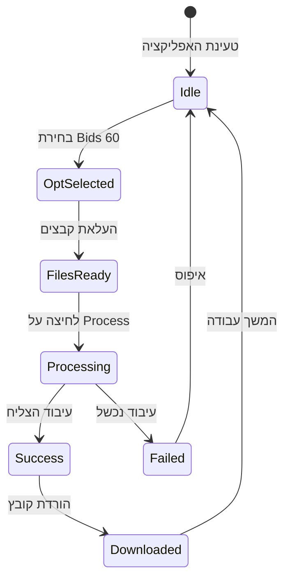

# תרשים זרימה מלא - אופטימיזציית Bids 60 Days

## 🎯 סקירה כללית



## 📁 ארכיטקטורת קבצים

```
business/bid_optimizations/bids_60_days/
├── __init__.py
├── orchestrator.py      # מנהל התהליך
├── constants.py         # קבועים
├── cleaner.py          # ניקוי נתונים
├── processor.py        # עיבוד וחישובים
└── output_formatter_60_days.py  # פורמט פלט

app/
├── pages/bid_optimizer.py       # [עדכון] אינטגרציה ראשית
├── state/bid_state.py           # [עדכון] ניהול מצב
└── ui/
    ├── components/checklist.py  # [עדכון] checkbox
    └── shared/
        ├── upload_section.py     # [עדכון] כפתורי העלאה
        └── output_section.py     # [עדכון] הצגת תוצאות
```

## 🔄 תהליך ניקוי נתונים



## 🧮 תהליך עיבוד - 7 שלבים

```mermaid
flowchart TD
    Start([נתונים נקיים]) --> Step0[שלב 0: יצירת עמודות עזר]
    Step0 --> Step1[שלב 1: מילוי עמודות בסיס]
    
    Step1 --> CheckCPA{Target CPA?}
    CheckCPA -->|NULL| Harvest[העברה ל-For Harvesting]
    CheckCPA -->|קיים| Step3[שלב 3: חישוב calc1, calc2]
    
    Step3 --> CheckCalc2{calc2 < 1.1?}
    CheckCalc2 -->|כן| SetBid1[Bid = calc1]
    CheckCalc2 -->|לא| CheckType{Exact או ASIN?}
    
    CheckType -->|כן| Step4[שלב 4: Temp_Bid = calc1]
    CheckType -->|לא| SetBid2[Bid = Old Bid × 1.1]
    
    Step4 --> Step5[שלב 5: חישוב Max_Bid]
    Step5 --> CheckUnits{units < 3?}
    CheckUnits -->|כן| MaxBid1[Max_Bid = 0.8 / (1+BA)]
    CheckUnits -->|לא| MaxBid2[Max_Bid = 1.25 / (1+BA)]
    
    MaxBid1 --> Step6[שלב 6: calc3 = Temp - Max]
    MaxBid2 --> Step6
    
    Step6 --> Step7{calc3 < 0?}
    Step7 -->|כן| FinalBid1[Bid = Temp_Bid]
    Step7 -->|לא| FinalBid2[Bid = Max_Bid]
    
    SetBid1 --> Step8[שלב 8: סימון לצביעה]
    SetBid2 --> Step8
    FinalBid1 --> Step8
    FinalBid2 --> Step8
```

## 🎨 קריטריונים לצביעת שורות



## 📊 מבנה קובץ הפלט

### גיליון 1: Targeting (58 עמודות)
```
[48 עמודות מקוריות] + [10 עמודות עזר חדשות]:
• Old Bid
• calc1
• calc2
• Target CPA
• Base Bid
• Adj. CPA
• Max BA
• Temp Bid
• Max_Bid
• calc3
```

### גיליון 2: Bidding Adjustment (48 עמודות)
```
עמודות מקוריות בלבד - ללא צביעה
```

### גיליון 3: For Harvesting
```
שורות עם Target CPA = NULL
מבנה זהה לגיליון Targeting
```

## 🔀 זרימת נתונים בין מודולים



## 📈 סטטיסטיקות ומעקב



## 🚦 מצבי המערכת



## ⚠️ טיפול בשגיאות

| סוג שגיאה | טיפול | הודעה למשתמש |
|-----------|--------|---------------|
| ערך NULL בעמודה קריטית | צביעה ורוד + המשך | "Null Error" בעמודת Bid |
| שגיאת חישוב | צביעה ורוד + המשך | "Calculation Error" בעמודת Bid |
| CVR < 8% | צביעה ורוד | "[X] rows with CVR < 8%" |
| Bid < 0.02 | צביעה ורוד | "[Y] rows with Bid < 0.02" |
| Bid > 1.25 | צביעה ורוד | "[Z] rows with Bid > 1.25" |

## 🎯 נקודות מפתח לפיתוח

### ✅ שלבי פיתוח מומלצים:
1. **תשתית** - יצירת מודול והגדרות
2. **ניקוי** - מימוש קריטריוני סינון
3. **עיבוד** - לוגיקת 7 השלבים
4. **ממשק** - הוספת checkbox וכפתורים
5. **מצב** - ניהול bulk_60_bids
6. **פלט** - פורמט 3 גיליונות
7. **אינטגרציה** - חיבור כל החלקים

### 🔄 שימוש חוזר בקוד:
- וולידציה: **100% קבצים גלובליים קיימים**
- ניקוי: **80% דומה ל-Bids 30**
- עיבוד: **100% זהה ל-Bids 30**
- פורמט: **חדש - גיליון For Harvesting**

### 📝 הערות חשובות:
- אין צורך בקבצי וולידציה חדשים
- Bulk 60 נשמר ב-`bulk_60_bids` (לא `bulk_60`)
- ניקוי אוטומטי בהחלפת אופטימיזציה
- צביעת כותרות בתכלת - עמודות משתתפות
- Conversion Rate מעמודה 55 בבאלק המקורי