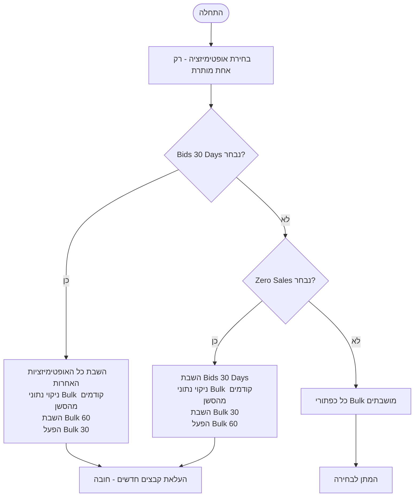
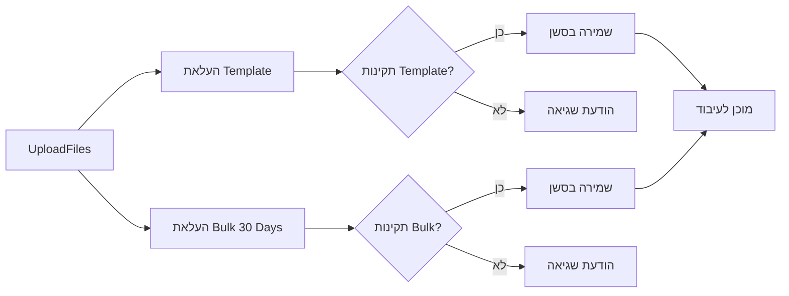
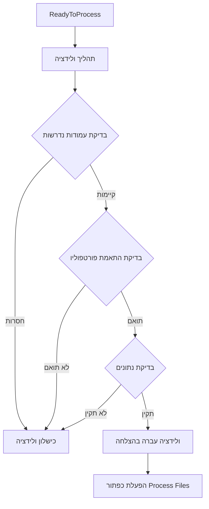
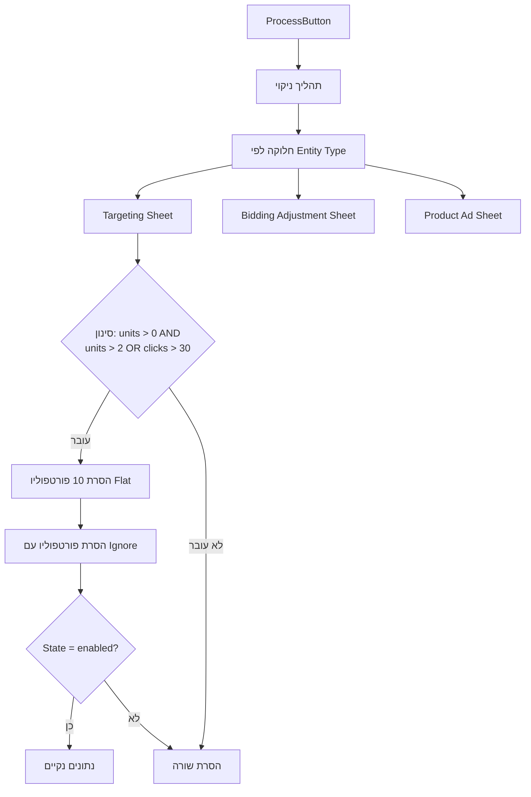
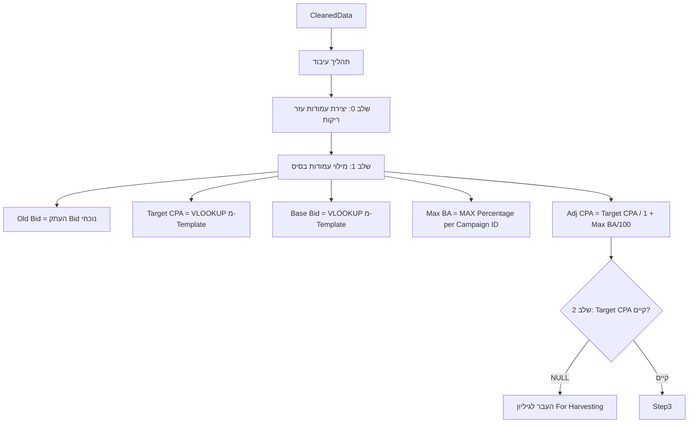
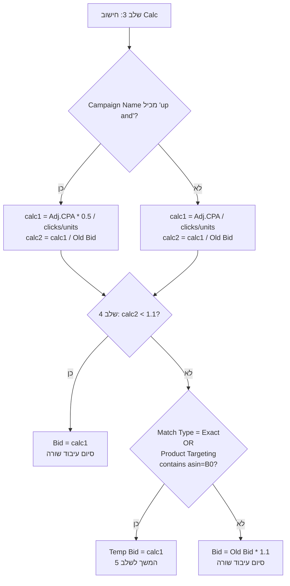
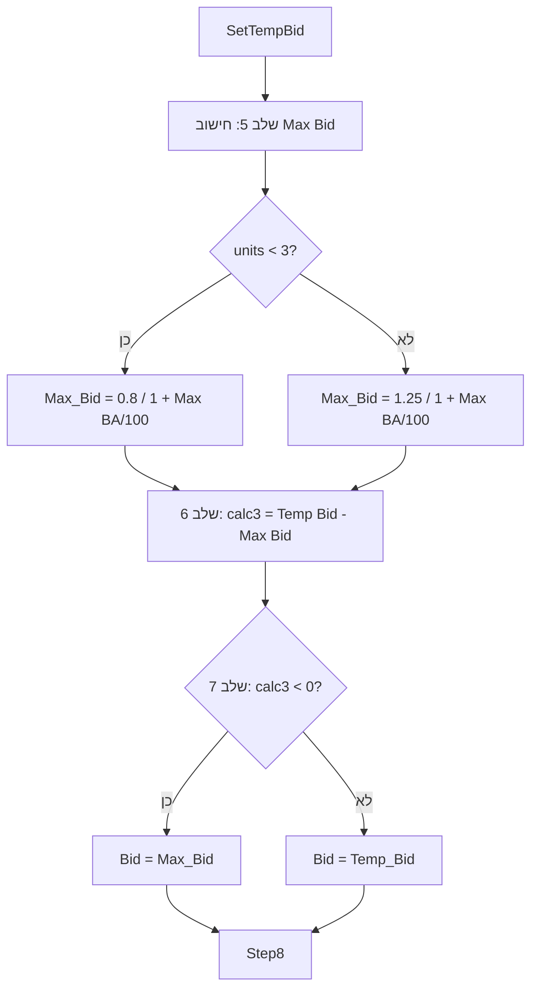
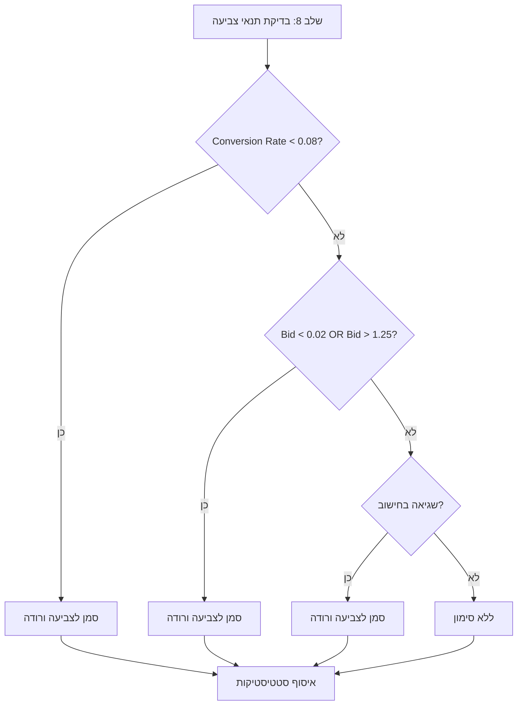
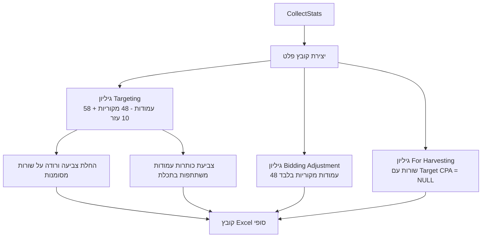
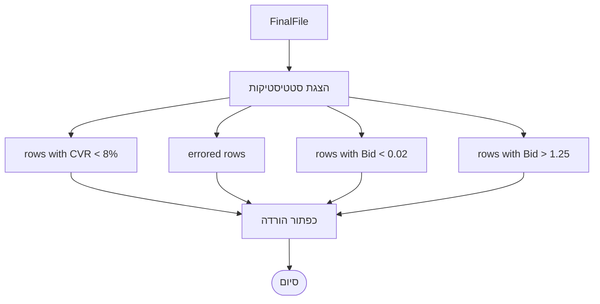

# תרשים זרימה מלא - Bids 30 Days Optimization

## 🎯 תהליך ראשי

## 📁 שלב 1: העלאת קבצים

## ✅ שלב 2: ולידציה

## 🧹 שלב 3: ניקוי נתונים

## 🔢 שלב 4: עיבוד חישובים - חלק א'

## 🔢 שלב 4: עיבוד חישובים - חלק ב'

## 🔢 שלב 4: עיבוד חישובים - חלק ג'

## 🎨 שלב 5: סימון וצביעה

## 📊 שלב 6: יצירת פלט

## 📈 שלב 7: הצגת תוצאות

## 📋 סיכום עמודות עזר

| עמודה | מיקום | חישוב |
|--------|--------|--------|
| Old Bid | לפני Bid | העתק Bid מקורי |
| calc1 | אחרי Bid | Adj.CPA × מכפיל / (clicks/units) |
| calc2 | אחרי calc1 | calc1 / Old Bid |
| Target CPA | לפני Base Bid | VLOOKUP מ-Template |
| Base Bid | לפני Adj. CPA | VLOOKUP מ-Template |
| Adj. CPA | לפני Max BA | Target CPA / (1 + Max BA/100) |
| Max BA | לפני Old Bid | MAX(Percentage) per Campaign ID |
| Temp Bid | אחרי Old Bid | calc1 (בתנאים מסוימים) |
| Max_Bid | אחרי Bid | 0.8 או 1.25 / (1 + Max BA/100) |
| calc3 | אחרי Max_Bid | Temp Bid - Max_Bid |

## 🚫 כללי הדרה

### פורטפוליו מוחרגים (10):
- Flat 30
- Flat 25
- Flat 40
- Flat 25 | Opt
- Flat 30 | Opt
- Flat 20
- Flat 15
- Flat 40 | Opt
- Flat 20 | Opt
- Flat 15 | Opt

### תנאי סינון:
- ✅ units > 0
- ✅ units > 2 OR clicks > 30
- ✅ State = enabled
- ✅ Campaign State = enabled
- ✅ Ad Group State = enabled
- ❌ Base Bid = "Ignore"
- ❌ Target CPA = NULL → העברה ל-"For Harvesting"

## 🎨 קודי צבע

- **ורוד** 🟪: שורות עם שגיאה/CVR נמוך/Bid מחוץ לטווח
- **תכלת** 🟦: כותרות עמודות משתתפות בעיבוד
- **ללא צבע**: שורות תקינות ועמודות לא משתתפות