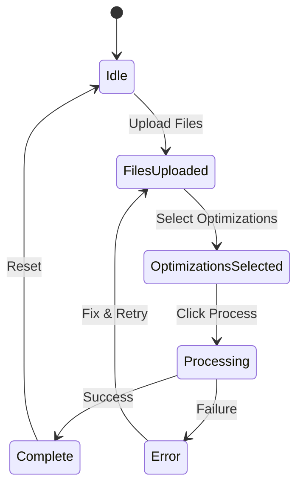

# איפיון ניהול State - Bid Optimizer

## 1. סקירה כללית

### עקרונות
- שימוש ב-Streamlit Session State
- State נפרד לכל עמוד
- אין State persistence (רק בזמן הסשן)
- State מתאפס ב-refresh

## 2. מבנה Session State

### Root Structure
```python
st.session_state = {
    # Navigation
    'current_page': 'bid_optimizer',  # או 'campaigns_optimizer'
    'sidebar_expanded': True,
    
    # Files
    'template_file': None,
    'template_df': {
        'Port Values': pd.DataFrame(),
        'Top ASINs': pd.DataFrame()
    },
    'bulk_7_file': None,
    'bulk_7_df': None,
    'bulk_30_file': None,
    'bulk_30_df': None,
    'bulk_60_file': None,
    'bulk_60_df': None,
    'data_rova_file': None,  # TBD
    'data_rova_df': None,    # TBD
    
    # Processing
    'selected_optimizations': [],
    'processing_status': 'idle',  # idle, processing, complete, error
    'processing_progress': 0.0,
    
    # Output
    'output_files': {
        'working': None,
        'clean': None
    },
    'output_stats': {
        'rows_processed': 0,
        'rows_modified': 0,
        'errors': 0
    },
    
    # UI State
    'show_validation': False,
    'validation_results': {},
    'error_messages': [],
    'info_messages': []
}
```

## 3. State Lifecycle

### Initialization
```python
def initialize_state():
    """Initialize session state on first load"""
    
    if 'initialized' not in st.session_state:
        st.session_state.initialized = True
        st.session_state.current_page = 'bid_optimizer'
        st.session_state.selected_optimizations = []
        st.session_state.processing_status = 'idle'
        # ... initialize all fields
```

### State Transitions


## 4. File Management State

### File Upload State
```python
def update_file_state(file_type: str, uploaded_file):
    """Update state when file is uploaded"""
    
    # Store file
    st.session_state[f'{file_type}_file'] = uploaded_file
    
    # Read and store DataFrame
    if uploaded_file:
        if file_type == 'template':
            # Read both sheets
            dfs = pd.read_excel(uploaded_file, sheet_name=None)
            st.session_state['template_df'] = dfs
        else:
            # Read bulk file
            df = pd.read_excel(
                uploaded_file, 
                sheet_name='Sponsored Products Campaigns'
            )
            st.session_state[f'{file_type}_df'] = df
    
    # Update UI flags
    st.session_state['show_validation'] = check_if_ready_to_validate()
```

### File State Checks
```python
def get_uploaded_files():
    """Get list of uploaded files"""
    files = {}
    for file_type in ['template', 'bulk_7', 'bulk_30', 'bulk_60', 'data_rova']:
        if st.session_state.get(f'{file_type}_file'):
            files[file_type] = True
    return files

def has_required_files(optimization: str) -> bool:
    """Check if required files are uploaded"""
    requirements = OPTIMIZATION_REQUIREMENTS[optimization]
    uploaded = get_uploaded_files()
    
    for file_type, required in requirements.items():
        if required and file_type not in uploaded:
            return False
    return True
```

## 5. Processing State

### Processing Status
```python
class ProcessingStatus:
    IDLE = 'idle'
    VALIDATING = 'validating'
    PROCESSING = 'processing'
    COMPLETE = 'complete'
    ERROR = 'error'

def update_processing_status(status: str, progress: float = 0):
    """Update processing status and progress"""
    st.session_state.processing_status = status
    st.session_state.processing_progress = progress
    
    # Force UI refresh
    st.experimental_rerun()
```

### Progress Tracking
```python
def track_optimization_progress(current: int, total: int, optimization: str):
    """Track progress of optimization processing"""
    
    progress = current / total
    st.session_state.processing_progress = progress
    
    # Store detailed progress
    if 'optimization_progress' not in st.session_state:
        st.session_state.optimization_progress = {}
    
    st.session_state.optimization_progress[optimization] = {
        'current': current,
        'total': total,
        'progress': progress
    }
```

## 6. Optimization Selection State

### Managing Selected Optimizations
```python
def toggle_optimization(opt_name: str):
    """Toggle optimization selection"""
    
    selected = st.session_state.get('selected_optimizations', [])
    
    if opt_name in selected:
        selected.remove(opt_name)
    else:
        selected.append(opt_name)
    
    st.session_state.selected_optimizations = selected
    
    # Check if we can process
    update_process_button_state()

def update_process_button_state():
    """Enable/disable process button based on state"""
    
    can_process = (
        len(st.session_state.selected_optimizations) > 0 and
        has_minimum_required_files() and
        st.session_state.processing_status == 'idle'
    )
    
    st.session_state.can_process = can_process
```

## 7. Validation State

### Validation Results Storage
```python
def store_validation_results(optimization: str, results: dict):
    """Store validation results for an optimization"""
    
    if 'validation_results' not in st.session_state:
        st.session_state.validation_results = {}
    
    st.session_state.validation_results[optimization] = {
        'timestamp': datetime.now(),
        'is_valid': results['is_valid'],
        'errors': results.get('errors', []),
        'warnings': results.get('warnings', []),
        'info': results.get('info', [])
    }
```

## 8. Output State

### Output File Management
```python
def store_output_files(working_file: BytesIO, clean_file: BytesIO):
    """Store generated output files"""
    
    st.session_state.output_files = {
        'working': working_file,
        'clean': clean_file,
        'timestamp': datetime.now()
    }
    
    # Store statistics
    st.session_state.output_stats = calculate_output_stats()
    
    # Update status
    st.session_state.processing_status = 'complete'
```

## 9. UI State

### Message Management
```python
def add_message(msg_type: str, message: str):
    """Add message to display queue"""
    
    if msg_type == 'error':
        if 'error_messages' not in st.session_state:
            st.session_state.error_messages = []
        st.session_state.error_messages.append(message)
    
    elif msg_type == 'info':
        if 'info_messages' not in st.session_state:
            st.session_state.info_messages = []
        st.session_state.info_messages.append(message)

def clear_messages():
    """Clear all messages"""
    st.session_state.error_messages = []
    st.session_state.info_messages = []
```

## 10. State Reset

### Full Reset
```python
def reset_state():
    """Reset entire application state"""
    
    # Keep only navigation
    current_page = st.session_state.get('current_page', 'bid_optimizer')
    
    # Clear everything
    for key in list(st.session_state.keys()):
        del st.session_state[key]
    
    # Reinitialize
    initialize_state()
    st.session_state.current_page = current_page
```

### Partial Reset
```python
def reset_processing_state():
    """Reset only processing-related state"""
    
    st.session_state.processing_status = 'idle'
    st.session_state.processing_progress = 0
    st.session_state.output_files = {'working': None, 'clean': None}
    st.session_state.output_stats = {}
    st.session_state.validation_results = {}
    clear_messages()
```

## 11. State Persistence (אופציונלי לעתיד)

### Save State
```python
def save_state_to_json():
    """Save state to JSON for debugging"""
    
    state_dict = {}
    for key, value in st.session_state.items():
        if isinstance(value, (str, int, float, bool, list, dict)):
            state_dict[key] = value
    
    return json.dumps(state_dict, indent=2)
```

## 12. State Debugging

### State Inspector
```python
def show_state_debug():
    """Show current state for debugging"""
    
    if st.checkbox("Show State Debug"):
        st.json({
            k: str(v)[:100] if not isinstance(v, (int, float, bool, list, dict)) else v
            for k, v in st.session_state.items()
        })
```

## 13. Multi-Page State

### Page-Specific State
```python
def get_page_state(page: str):
    """Get state specific to a page"""
    
    page_states = {
        'bid_optimizer': [
            'selected_optimizations',
            'template_df',
            'bulk_30_df'
        ],
        'campaigns_optimizer': [
            # TBD - Campaigns specific state
        ]
    }
    
    return {
        key: st.session_state.get(key)
        for key in page_states.get(page, [])
    }
```

## 14. Performance Considerations

### State Size Management
```python
def check_state_size():
    """Monitor state size to prevent memory issues"""
    
    total_size = 0
    large_items = []
    
    for key, value in st.session_state.items():
        size = sys.getsizeof(value)
        total_size += size
        
        if size > 10 * 1024 * 1024:  # 10MB
            large_items.append((key, size))
    
    if total_size > 100 * 1024 * 1024:  # 100MB
        st.warning("Session state is large, consider resetting")
    
    return total_size, large_items
```

## 15. Future State (TBD)

### Campaigns Optimizer State
```python
# TBD - יתווסף בשלב 5-6
campaigns_state = {
    'selected_processes': [],  # ['negation', 'harvesting']
    'campaign_settings': {},
    # ... more campaign-specific state
}
```